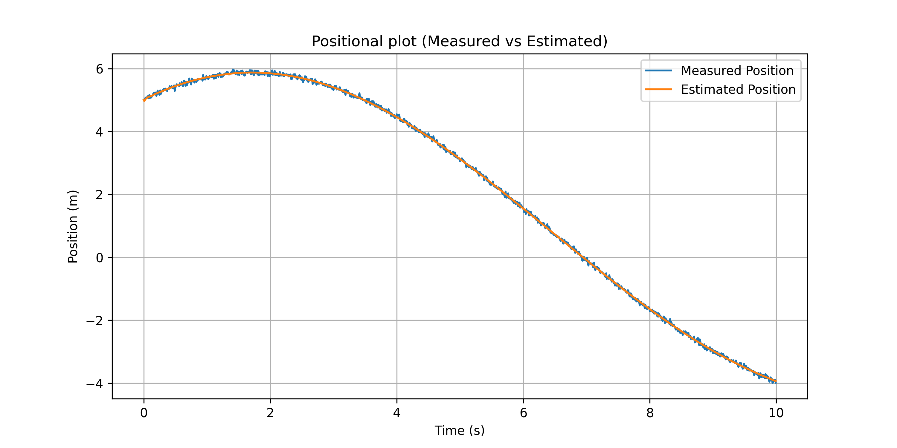
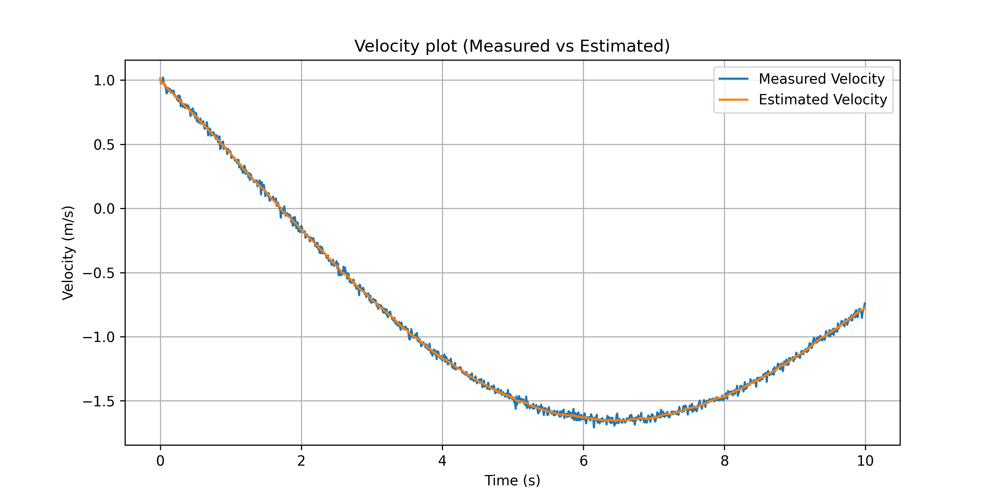
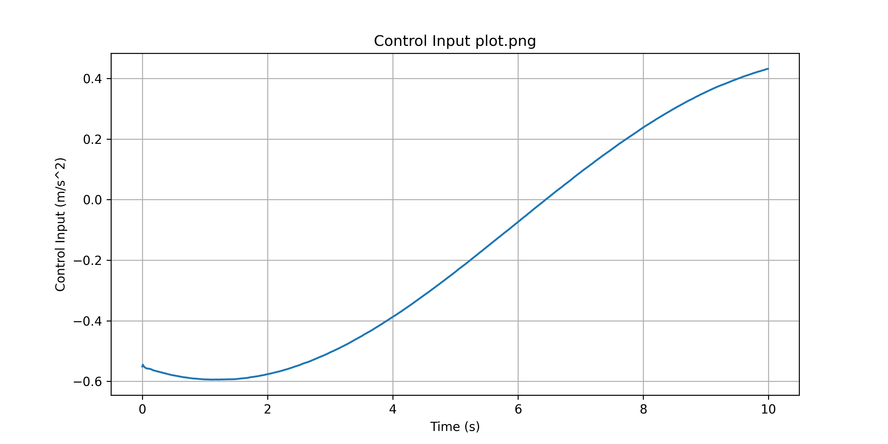

# Project #3 – C++ Estimation–Control System
## Overview
This project implements a discrete-time 1D dynamic system in C++ consisting of a simulated plant, noisy sensor measurements, an alpha–beta state estimator, and a PD controller.

The plant evolves according to applied control input using discrete-time integration. Measurements are generated by injecting Gaussian noise into the true state. An alpha–beta filter estimates position and velocity from noisy measurements, and a PD controller computes control input using only the estimated state.

The architecture mirrors a realistic robotics signal pipeline:
- Plant → Measurement → Estimator → Controller → Plant

Strict separation between ground truth, sensed data, estimation, and control logic is enforced throughout the system.

## System Architecture
- Plant
    - Owns true state (position, velocity)
    - Propagates dynamics using discrete-time integration
    - Injects Gaussian noise into measurements
    - Does not expose true state to estimator or controller

- Estimator (Alpha–Beta Filter)
    - Owns estimated state
    - Performs prediction and residual-based correction
    - Uses only noisy measurements
    - Does not access true state

- Controller (PD)
    - Owns gains (kp, kd) and actuator limits
    - Computes control input from estimated state
    - Operates strictly on inferred state

## Estimation Method
- The estimator implements a discrete-time alpha–beta filter consisting of prediction and residual-based correction steps.
    **Prediction**:
        x_predicted = x_estimated + v_estimated * dt
        v_predicted = v_estimated

    **Residual (Innovation)**:
        residual = x_measured - x_predicted

    **Correction**:
        x_estimated = x_predicted + alpha * residual
        v_estimated = v_predicted + (beta / dt) * residual

        - α controls position correction strength.
        - β controls velocity correction strength.
        - The β/dt scaling ensures unit consistency.

## Closed-Loop Behavior & Observations
- Position Tracking
    - The estimated position attenuates high-frequency measurement noise while preserving overall trajectory shape.
    - 

- Velocity Estimation
    - Higher β values increase responsiveness but amplify velocity noise due to residual scaling. Lower β values reduce noise injection but introduce lag.
    - A value of β = 0.02 provided a practical tradeoff under current noise conditions.
    - 

- Control Input
    - Because the PD controller operates on estimated velocity, noise in the estimator directly propagates into control effort. Reducing β significantly decreases control chatter while preserving stability.
    - 

## Key Insight
Estimator tuning fundamentally shapes closed-loop behavior; estimation quality directly bounds achievable control performance. Even with fixed controller gains, modifying β changes responsiveness, smoothness, and overall stability characteristics.

## Future Work
- Replace alpha–beta filter with full Kalman filter (covariance-based adaptive gains)
- Introduce bias state modeling to handle sensor drift
- Extend from 1D motion to 2D planar dynamics
- Incorporate actuator dynamics or delay modeling
- Integrate into a ROS node-based architecture
- Support configurable noise parameters for experimentation