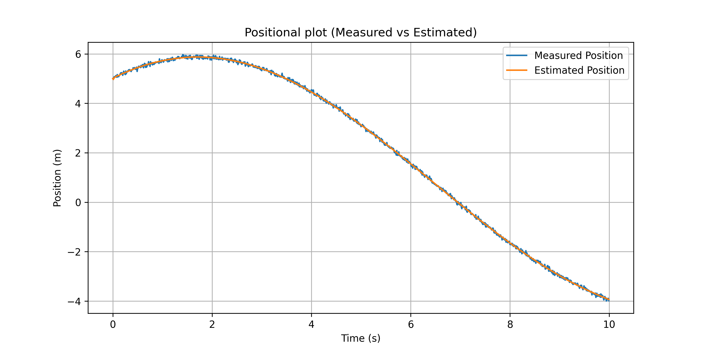
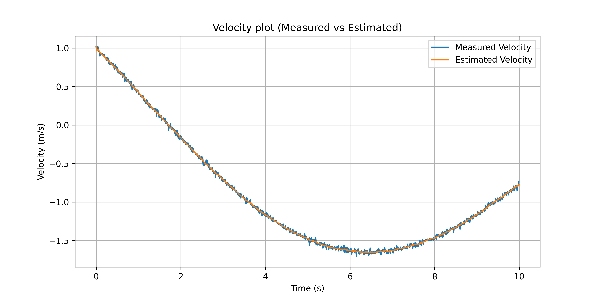
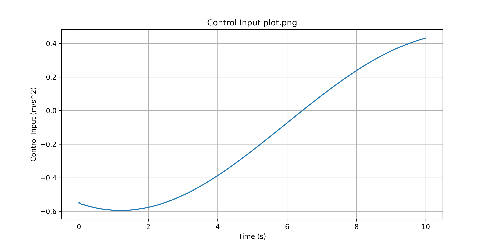

# Project #3 – C++ Estimation–Control System
## Overview
This project implements a discrete-time 1D dynamic system in C++ consisting of a simulated plant, noisy sensor measurements, a covariance-based Kalman state estimator, and a PD controller.

The plant evolves according to applied control input using discrete-time integration. Measurements are generated by injecting Gaussian noise into the true state. A two-state Kalman filter estimates position and velocity from noisy measurements, and a PD controller computes control input using only the estimated state.

The architecture mirrors a realistic robotics signal pipeline:
- Plant → Measurement → Estimator → Controller → Plant

Strict separation between ground truth, sensed data, estimation, and control logic is enforced throughout the system.

## System Architecture
- Plant
    - Owns true state (position, velocity)
    - Propagates dynamics using discrete-time integration
    - Models acceleration as control input
    - Injects Gaussian noise into measurements
    - Does not expose true state to estimator or controller

- Estimator (Alpha–Beta Filter)
    - Owns estimated state
    - Performs prediction and residual-based correction
    - Updates using innovation and covariance-weighted correction
    - Uses only noisy measurements
    - Does not access true state

- Controller (PD)
    - Owns gains (kp, kd) and actuator limits
    - Computes control input from estimated state
    - Operates strictly on inferred state

## Motion Model
Updates using innovation and covariance-weighted correction
- State: 
    - x = [position
           velocity]

- Discrete-time dynamics:   
    - x_k+1 = Ax_k + Bu_k + w_k
    - A = [1 dt 
           0  1]
    - B = [0.5dt^2
             dt   ]
    
- Where: 
    - u represents acceleration.
    - Process noise models acceleration uncertainty.

- Process covariance:
    - Q = σa^2​ * [(dt^4)/4 (dt^3)/2
                  (dt^3)/2     dt^2]

## Measurement Model
- Both position and velocity are measured with independent Gaussian noise:
    - Innovation = Hx + v
    - H = I (identity matrix)

- Measurement covariance:
    - R = [σa^2_pos    0
              0     σa^2_vel]

## Estimation Method (Kalman Filter)
Each update step consists of:
- Prediction
    - Propagate state using A and B
    - Propagate covariance using APA^T + Q

- Innovation 
    - residual = measurement - predicted_state

- Kalman Gain
    - K = P_minus/(P_minus + R) (since H = I)

- Correction
    - x_estimated = x_predicted + Kalman gain * residual
    - Uncertainty P = (I - K) * P_minus

Unlike the prebious alpha-beta implementation, gain values are computed adaptively from covariance rather than manually tuned parameters.

## Closed-Loop Behavior & Observations
- Position Tracking
    - The Kalman estimator attenuates measurement noise while maintaining responsiveness to true motion.
    - 

- Velocity Estimation
    - Velocity estimates converge smoothly due to covariance-weighted correction rather than fixed β scaling.
    - 

- Control Input
    - Because the controller operates on the estimated state, estimator tuning (process noise σₐ and measurement noise R) directly affects control smoothness and responsiveness
    - 

## Key Insight
Estimator design fundamentally shapes closed-loop performance.

Transitioning from a fixed-gain alpha–beta filter to a covariance-driven Kalman filter introduces adaptive gain behavior, enabling principled handling of measurement uncertainty and process noise.

## Future Work
- mplement Joseph form covariance update for improved numerical stability
- Compare position-only measurement model (H ≠ I)
- Extend from 1D motion to 2D planar dynamics
- Introduce bias state modeling
- Incorporate actuator delay modeling
- Integrate into ROS-based modular architecture
- Add configurable noise parameters via runtime configuration