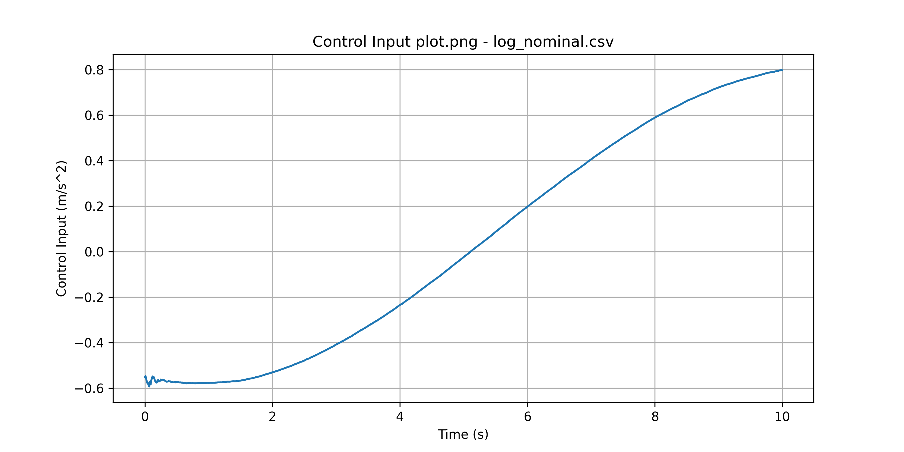
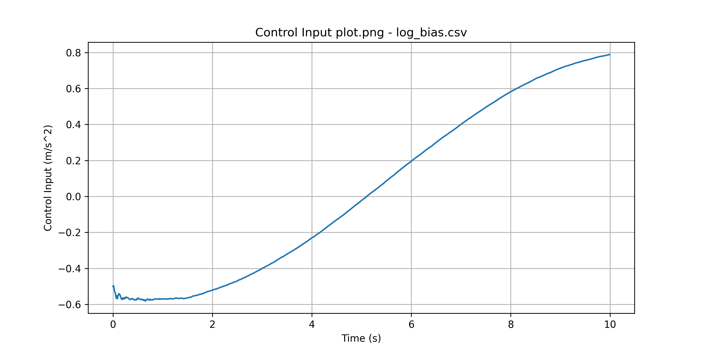

# Project #3 – C++ Estimation–Control System
## Overview
This project implements a discrete-time 1D dynamic system in C++ consisting of a simulated plant, noisy sensor measurements, a covariance-based Kalman state estimator, and a PD controller.

The plant evolves according to applied control input using discrete-time integration. Measurements are generated by injecting Gaussian noise into the true state.

Two estimator configurations are implemented:
- Nominal Mode (2-state KF) — estimates position and velocity
- Bias Mode (3-state KF) — estimates position, velocity, and acceleration bias

An A/B logging framework allows direct comparison between both estimators under identical conditions.

The architecture mirrors a realistic robotics signal pipeline:
- Plant → Measurement → Estimator → Controller → Plant

Strict separation between ground truth, sensed data, estimation, and control logic is enforced throughout the system.

## Engineering Motivation
- Many robotics systems must estimate vehicle state from noisy and incomplete sensor measurements before control decisions can be made.
- This project was built to explore how estimator design affects closed-loop control performance by comparing a standard Kalman filter against a bias-aware state estimator under identical operating conditions.

## Project Outcome
- Implemented a modular C++ estimation-control framework comparing nominal and bias-aware Kalman estimators.
- Results demonstrate that bias augmentation reduces systematic drift, improves state consistency, and produces more stable closed-loop behavior.

## System Architecture
- Plant
    - Simulates true position and velocity dynamics
    - Generates noisy measurements

- Estimator
    - Nominal 2-state Kalman filter
    - Bias-aware 3-state Kalman filter
    - Explicit covariance propagation without external libraries

- Controller
    - PD controller operating on estimated state
    
```text
    Plant
    │
    ▼
    Measurement
    │
    ▼
    Kalman Filter
    │
    ▼
    PD Controller
    │
    └─────────────► Plant
```

## Key Insight
Estimator structure fundamentally shapes closed-loop performance.
- Transitioning from:
    - Fixed-gain alpha-beta filter
        → Covariance-driven Kalman filter
        → Bias-augmented state estimator
demonstrates how model fidelity improves state consistency, removes systematic drift, and stabilizes control behavior.

Bias modeling transforms persistent steady-state error into an identifiable and correctable state.

## Closed-Loop Behavior & Observations
- Nominal:
    - Velocity exhibits steady-state error when plant contains acceleration bias
    - Estimator cannot explain persistent drift
    - Position Tracking
        - The Kalman estimator attenuates measurement noise while maintaining responsiveness to true motion.
        - 

    - Velocity Estimation
        - Velocity estimates converge smoothly due to covariance-weighted correction rather than fixed β scaling.
        - 

    - Control Input
        - Because the controller operates on the estimated state, estimator tuning (process noise σₐ and measurement noise R) directly affects control smoothness and responsiveness
        - 

- Bias Mode (3-state KF + position-only update):
    - Bias Convergence
        - Acceleration bias is not directly measured (H = [1 0 0]), but becomes observable over time because its effect accumulates in position.
        - The estimator learns bias through persistent position residuals and converges toward the true plant bias.
        - 

    - Position Tracking
        - Once bias is estimated, the prediction model becomes consistent (effective accel = u - bias), reducing drift and improving position tracking.
        - 

    - Velocity Estimation
        - Velocity is inferred from position over time; with bias compensated, the estimated velocity aligns more closely with the true underlying motion.
        - 

    - Control Input
        - Because the controller operates on the estimated state, bias compensation improves control consistency and reduces the need for the controller to “fight” systematic model error.
        - 

## Implementation Details
- Constant-velocity state model
- Covariance-based Kalman filtering
- Bias-augmented estimator variant
- PD control operating on estimated state
- Explicit covariance propagation without external matrix libraries

## Technologies Used
- C++
- Object-Oriented Design
- Kalman Filtering
- State Estimation
- PD Control
- CSV Logging
- Python Visualization

## Future Work
- Implement Joseph form covariance update for improved numerical stability
- Introduce bias random-walk modeling in the plant
- Extend from 1D motion to 2D planar dynamics
- Incorporate actuator delay modeling
- Integrate into ROS-based modular architecture
- Add runtime-configurable noise parameters
- Compare position-only vs full-state measurement observability