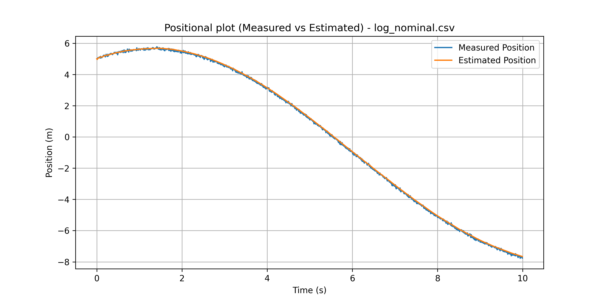
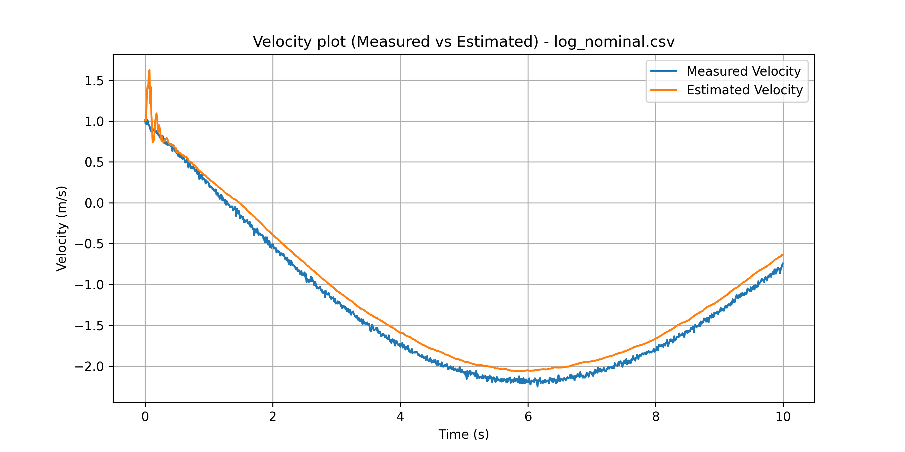
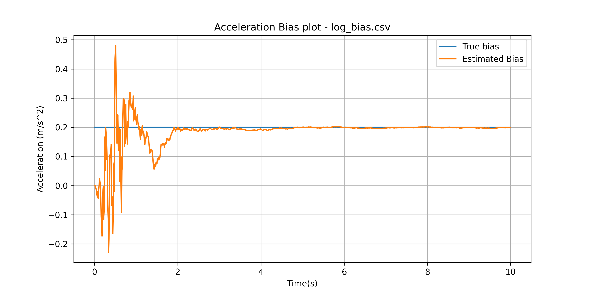
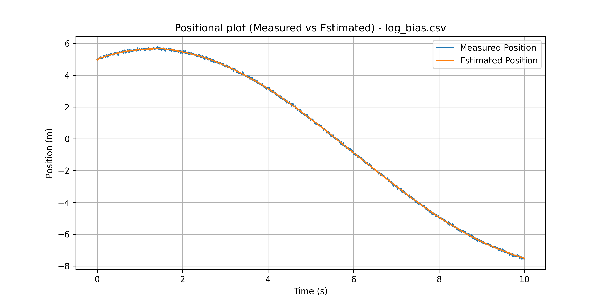
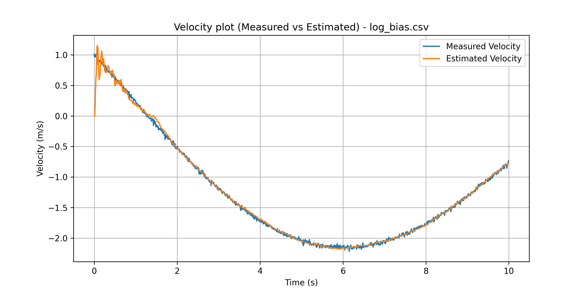

# Project #3 – C++ Estimation–Control System
## Overview
This project implements a discrete-time 1D dynamic system in C++ consisting of a simulated plant, noisy sensor measurements, a covariance-based Kalman state estimator, and a PD controller.

The plant evolves according to applied control input using discrete-time integration. Measurements are generated by injecting Gaussian noise into the true state.

Two estimator configurations are implemented:
- Nominal Mode (2-state KF) — estimates position and velocity
- Bias Mode (3-state KF) — estimates position, velocity, and acceleration bias

An A/B logging framework allows direct comparison between both estimators under identical conditions.

The architecture mirrors a realistic robotics signal pipeline:
- Plant → Measurement → Estimator → Controller → Plant

Strict separation between ground truth, sensed data, estimation, and control logic is enforced throughout the system.

## System Architecture
- Plant
    - Owns true state (position, velocity)
    - Propagates dynamics using discrete-time integration
    - Models acceleration as control input
    - Injects Gaussian noise into measurements
    - Does not expose true state to estimator or controller

- Estimator (Kalman Filter)
   Two variants:
    1) Nominal (2-state)
        - State: [position, velocity]
        - Uses both position and velocity measurements

    2) Bias-Aware (3-state)
        - State: [position, velocity, bias]
        - Models unknown constant acceleration bias
        - Uses position-only measurement update
        - Learns bias through accumulated position residuals

    - Both estimators:
        - Perform prediction and residual-based correction
        - Propagate covariance explicitly (no matrix libraries used)
        - Use only noisy measurements
        - Do not access true state

- Controller (PD)
    - Owns gains (kp, kd) and actuator limits
    - Computes control input from estimated state
    - Operates strictly on inferred state

## Motion Model
- Nominal (2-state)
    - State: 
        - x = [position
               velocity]

    - Discrete-time dynamics:   
        - x_k+1 = Ax_k + Bu_k + w_k
        - A = [1 dt 
               0  1]
        - B = [0.5dt^2
                 dt   ]
    
    - Process noise models acceleration uncertainty.
        - Process covariance: Q = σₐ² * [dt⁴/4  dt³/2
                                         dt³/2    dt²]
    
- Bias-Aware (3-State)
    - State:
        - x = [position
               velocity
                 bias  ]

    - Dynamics:
        - position_k+1 = position_k + velocity_k * dt + 0.5 (u - bias_k) * dt^2
        - velocity_k+1 = velocity_k + (u - bias_k) * dt
        - bias_k+1     = bias_k

    - Where:
        - u is commanded acceleration
        - bias represents unknown acceleration offset

    - Process noise:
        - Acceleration uncertainty (σ_a)
        - Bias random-walk parameter (σ_b), modeling slow drift in bias

## Measurement Model
- Nominal:
    - Both position and velocity are measured with independent Gaussian noise:
        - Measurement model: z = Hx + v
        - Innovation (residual): r = z - Hx_pred
        - H = I (identity matrix)

    - Measurement covariance:
        - R = [(σ_pos)^2    0
                0     (σ_vel)^2]

- Bias:
    - Only position is measured:
        - H = [1  0  0]

    - Innovation Covariance:
        - S = H P Hᵀ + R = P11_minus + R 

    - Velocity and bias are not directly measured, but become observable over time because their influence accumulates in position error.

## Estimation Method (Kalman Filter)
Each update step consists of:
- Prediction
    - Propagate state using motion model
    - Propagate covariance using APA^T + Q

- Innovation 
    - residual = measurement - predicted_state

- Kalman Gain
    - K = (P_minus * H^T) / (H * P_minus * H^T + R)

- Correction
    - x_estimated = x_predicted + Kalman gain * innovation
    - Uncertainty P = (I - K * H) * P_minus

Unlike the previous alpha-beta implementation, gain values are computed adaptively from covariance rather than manually tuned parameters.

## Closed-Loop Behavior & Observations
- Nominal:
    - Velocity exhibits steady-state error when plant contains acceleration bias
    - Estimator cannot explain persistent drift
    - Position Tracking
        - The Kalman estimator attenuates measurement noise while maintaining responsiveness to true motion.
        - 

    - Velocity Estimation
        - Velocity estimates converge smoothly due to covariance-weighted correction rather than fixed β scaling.
        - 

    - Control Input
        - Because the controller operates on the estimated state, estimator tuning (process noise σₐ and measurement noise R) directly affects control smoothness and responsiveness
        - 

- Bias Mode (3-state KF + position-only update):
    - Bias Convergence
        - Acceleration bias is not directly measured (H = [1 0 0]), but becomes observable over time because its effect accumulates in position.
        - The estimator learns bias through persistent position residuals and converges toward the true plant bias.
        - 

    - Position Tracking
        - Once bias is estimated, the prediction model becomes consistent (effective accel = u - bias), reducing drift and improving position tracking.
        - 

    - Velocity Estimation
        - Velocity is inferred from position over time; with bias compensated, the estimated velocity aligns more closely with the true underlying motion.
        - 

    - Control Input
        - Because the controller operates on the estimated state, bias compensation improves control consistency and reduces the need for the controller to “fight” systematic model error.
        - 

## Key Insight
Estimator structure fundamentally shapes closed-loop performance.
- Transitioning from:
    - Fixed-gain alpha-beta filter
        → Covariance-driven Kalman filter
        → Bias-augmented state estimator
demonstrates how model fidelity improves state consistency, removes systematic drift, and stabilizes control behavior.

Bias modeling transforms persistent steady-state error into an identifiable and correctable state.

## Future Work
- Implement Joseph form covariance update for improved numerical stability
- Introduce bias random-walk modeling in the plant
- Extend from 1D motion to 2D planar dynamics
- Incorporate actuator delay modeling
- Integrate into ROS-based modular architecture
- Add runtime-configurable noise parameters
- Compare position-only vs full-state measurement observability